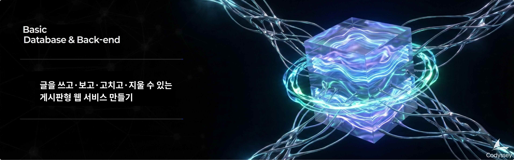

# B5-2: 글을 쓰고·보고·고치고·지울 수 있는 게시판형 웹 서비스 만들기

## 📋 과제 정보

| 항목 | 내용 |
|------|------|
| **과목** | 데이터베이스와 백엔드 (Database & Back-end) |
| **난이도** | ★★☆ (Lv.2) |
| **학습 시간** | 60분 |
| **필수 여부** | 🔵 선택 |
| **진행 상태** | 평가전 |
| **과제 번호** | 185013 |

---

## 🎯 미션 설명



---

## 🛠️ 개발 환경

### 6\. 개발 환경

*   Python 3.10 이상

---

## ⚠️ 제약 사항

### 7\. 제약 사항

*   의존성
    *   `fastapi`, `uvicorn`, `sqlalchemy`, `jinja2`, `python-multipart` 범위 내에서만 사용한다. 그 외 외부 라이브러리는 추가하지 않는다.
*   구조
    *   라우터, 서비스, 저장소, 모델 코드는 역할에 맞게 분리한다.
    *   템플릿 파일은 `templates/` 디렉터리 아래에 둔다.
*   기능 범위
    *   로그인/권한/인증은 구현하지 않는다. 이 내용은 다음 미션에서 다룬다.
    *   모델 간 관계(연관관계)는 구현하지 않는다. 이 내용도 다음 미션에서 다룬다.
*   권장 사항
    *   SQLAlchemy ORM 모델을 직접 라우터에서 반환하지 않고, Pydantic Schema(요청/응답 모델) 또는 별도 DTO 객체로 분리하여 사용하는 것을 권장

---

## 📝 결과 예시

### 8\. 결과 예시

아래는 정답이 아니라 참고 예시다. 실제 문구, 디자인은 얼마든지 달라도 된다.

*   **홈 화면 예시 (GET /)**
    
    ```css
    나의 메모 앱
    
    메모를 등록하고 목록/상세/수정/삭제할 수 있습니다.
    
    [메모 목록 보기] [새 메모 작성]
    ```
    
*   **목록 화면 예시**
    
    ```css
    메모 목록
    
    - 오늘 배운 것 정리    [상세보기]
    - 내일 할 일            [상세보기]
    
    [새 메모 작성]
    ```

---

## 📊 평가 정보

- 평가 대상: 예

---

> *이 문서는 Codyssey AI/SW 기초 과정의 과제 내용을 기반으로 자동 생성되었습니다.*
